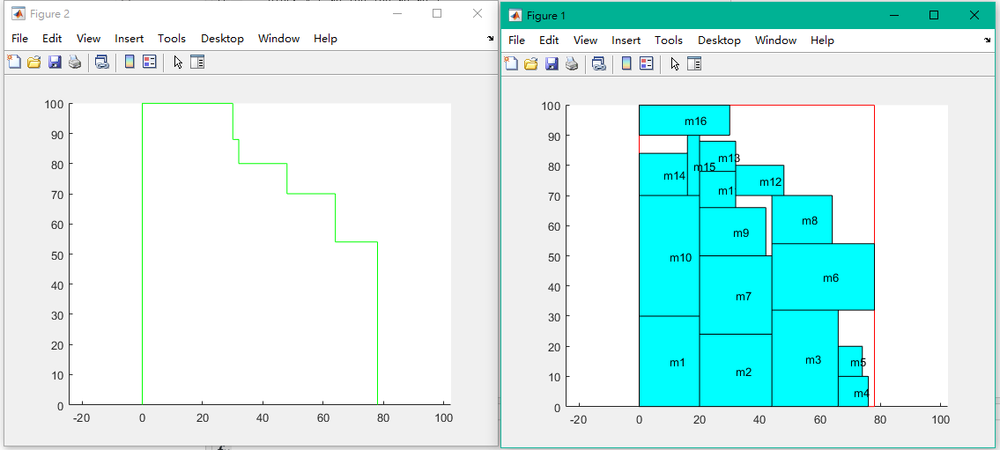
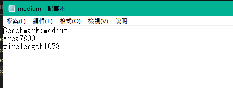
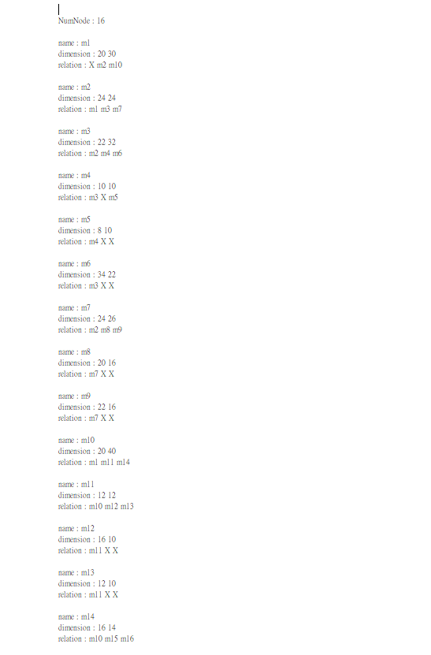
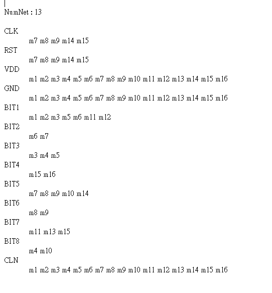

# EDA-packing
## intorduction
**this program help packing modules within a chip,by calculating its min area ,min wirelength,and also draw out module display and the contour**

## sample output
**graph on matlab**

**report.txt**

## sample input
**nodes**

**nets**

## details
此程式read module(.nets .nodes)file後
用binary tree 儲存各個module的相對位置關係
用inorder traversal的方式建立整個chip graph
含有所有的module(在matlab中畫出)
用doubly linked list 去建立contour

## 使用說明
會先問有幾個case要測
testcases 的資料放在benchmark1裡面就好(testcases資料夾與.nets ,nodes檔案名稱相同)
請輸入benchmark 資料夾的名子 (ex:這邊是benchmark1)
以及依序輸入testcases的名稱

以此為例
total number of testcases
4

step1:please input Benchmark name
benchmark1

step2:please input testcase filename (without .nodes or .net)
apte
-->>產出 apte.m apte.txt

step2:please input testcase filename (without .nodes or .net)
example
-->>產出 example.m example.txt

step2:please input testcase filename (without .nodes or .net)
simple
-->>產出 simple.m simple.txt

step2:please input testcase filename (without .nodes or .net)
medium
-->>產出 medium.m medium.txt
